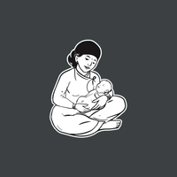
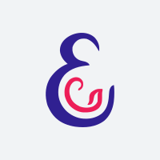
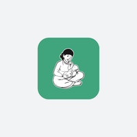
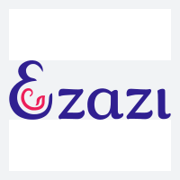
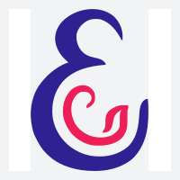
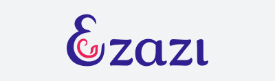
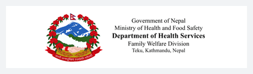
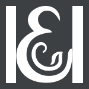
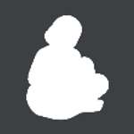

# Brand images — what each brand ships, and what is still needed

Current state of every brand-varying image, one section per place it appears, eZazi then eLCG
Nepal. For icon *history* and how the current icons came to be, see
[BRAND-ICON-FORENSICS.md](BRAND-ICON-FORENSICS.md) — this document is about what ships today.

The app is one codebase shipped as separate products — eZazi (India), eLCG (Nepal), Bangladesh
next. Of roughly 340 image resources, only these **six names** differ per brand. Each brand
supplies its own file under the same name, so no code is brand-aware:

| Slot | Resource name | Type |
|---|---|---|
| App icon | `ic_launcher_foreground` | mipmap, 5 densities |
| Launch splash | `ic_launch_icon` | drawable |
| Splash screen | `ic_splash_logo` | drawable |
| Login screen | `ic_login_logo` | drawable |
| Home header | `ic_header_logo` | drawable |
| Status bar | `ic_notification` | drawable |

**eZazi is complete** — all six are VectorDrawables converted from the designer's SVGs.
**eLCG Nepal uses partner-supplied rasters**, which are what they are for now.

A Gradle check warns at build time if a flavour is missing any of these, because a missing file
does not fail the build — Android silently falls back to `main`, which would ship India's artwork
in another brand's app.

Previews below are rendered from the files that actually ship, and live in
[images/](images/). eZazi's are vectors, so they cannot be shown inline directly.

---

## 1 — App icon

| | file | state |
|---|---|---|
| eZazi | `ic_launcher_foreground.png` ×5 densities | 108/162/216/324/432px, from vector |
| eLCG | `ic_launcher_foreground.png` | 1024 × 1024 |

 

**Spec: 1024 × 1024, square, transparent. Artwork about 45% of the canvas** (roughly 460 × 460),
centred, and **never past the central 66%**.

Two different numbers, and confusing them is what went wrong the first time round:

- **66% is the crop line**, not a target. The launcher masks everything outside it into a circle or
  squircle. Artwork drawn *at* 66% fills the visible circle edge to edge and looks cramped next to
  every other icon on the home screen.
- **~45% is where the artwork should sit.** In Android's units that is a glyph about 48dp tall in a
  108dp canvas, landing at roughly two-thirds of the 72dp visible circle — which is where a normal
  launcher glyph sits, with margin around it.

The first delivery followed "inside the central 66%" literally and measured 65.6%, which rendered
99% of the visible circle. Regenerated at 48dp.

The background is a colour set in the app, not part of the image: eZazi `#FFFFFF`, Nepal `#40A47C`.

---

## 2 — Launch splash

The brief flash while the app starts, before the app's own splash screen.

| | file | state |
|---|---|---|
| eZazi | `ic_launch_icon.xml` | vector, keeps the app-icon safe-zone padding |
| eLCG | `ic_launch_icon.png` | 1024 × 1024, green background baked in |

 

**Spec: 1024 × 1024, square, transparent.** Drawn at 180dp on tablet, 100dp on phone.

Nepal's has its green baked in, which is why that background cannot be themed per brand.

---

## 3 — Splash screen

The app's own splash, after launch.

| | file | state |
|---|---|---|
| eZazi | `ic_splash_logo.xml` | vector, cropped tight |
| eLCG | `ic_splash_logo.png` | 496 × 420, white background baked in |

 

**Spec: 1024 × 1024, square, transparent.** Drawn at 280 × 250dp on tablet.

---

## 4 — Login screen

| | file | state |
|---|---|---|
| eZazi | `ic_login_logo.xml` | vector, cropped tight |
| eLCG | `ic_login_logo.png` | 496 × 420 — **the same file as the splash screen** |

 

**Spec: 1024 × 1024, square, transparent.** Drawn at 280 × 280dp on tablet.

---

## 5 — Home screen header

| | file | state |
|---|---|---|
| eZazi | `ic_header_logo.xml` | vector, 3.4:1, artwork 65% of height, centred |
| eLCG | `ic_header_logo.png` | 637 × 213 (3:1), artwork fills 100% |

 

**Spec: aspect 3.4 : 1** — 1360 × 400 as a PNG, or any size as a vector. Artwork fills **65% of
the height, centred both ways**. Drawn at 100dp tall.

This is the one slot with a strict shape. The app applies **one height setting to every brand's
header logo**, so how big a logo looks depends entirely on how much of its canvas the artwork
fills. eZazi's is 65%; Nepal's is 100%, cropped hard to the edges, which is why Nepal's renders
noticeably larger from the identical setting. Following 3.4 : 1 / 65% / centred means one setting
works for every brand and a new country needs no code change.

**Known gap:** Nepal's file is off-convention and its flavour sets `home_logo_height` only in the
unqualified `values/` bucket, so on any tablet `main`'s `values-sw600dp` wins instead. Both are
open.

---

## 6 — Status bar notification

| | file | state |
|---|---|---|
| eZazi | `ic_notification.xml` | vector, flattened to white |
| eLCG | `ic_notification.png` | 96 × 96 |

 

**Spec: 96 × 96, square, transparent, one solid shape — no text, no colour, no fine lines.**

Drawn at 24dp, about the size of a full stop, and **Android discards the colour entirely**,
rendering only the silhouette. eZazi's is flattened to white in the file so it matches what
actually renders. Nepal's line drawing collapses into a blob at that size and is the one slot
that needs genuinely new artwork rather than a re-export.

---

## How much of the canvas the artwork should fill

Canvas size fixes sharpness only. What decides how **big** a logo looks is the artwork's share of
its canvas, because each view has a fixed dp box and fits the whole canvas into it. Margin inside
the file is not neutral — it silently shrinks the logo.

| Slot | Fill rule | Why |
|---|---|---|
| App icon | artwork at about **45% of the canvas**, never past 66% | 66% is where the launcher crops, not where the artwork should reach |
| Home header | **65% of height, centred** | one shared height setting must suit every brand |
| Everything else | **cropped tight to the artwork** | the app sizes the box, so tight is predictable |

Only the app icon needs padding built in.

---

## Where brand images come from

Partner organisations supply these, and they are often downloaded from the partner's website
rather than exported from source artwork. That means vector originals frequently do not exist, and
converting a raster to SVG does not create one — tracing loses detail, and wrapping a PNG in an
SVG produces a file Android cannot render at all. Where no vector exists, the honest ask is the
**largest raster available**, at or above the pixel sizes above.

A specification guide aimed at partners is still to be written.
