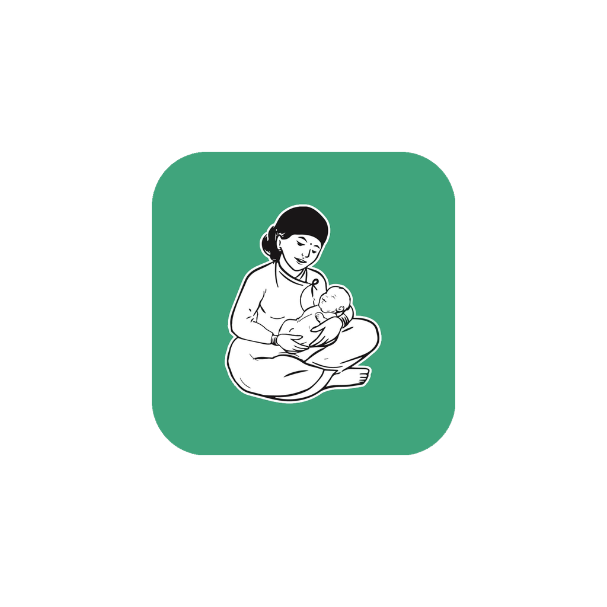
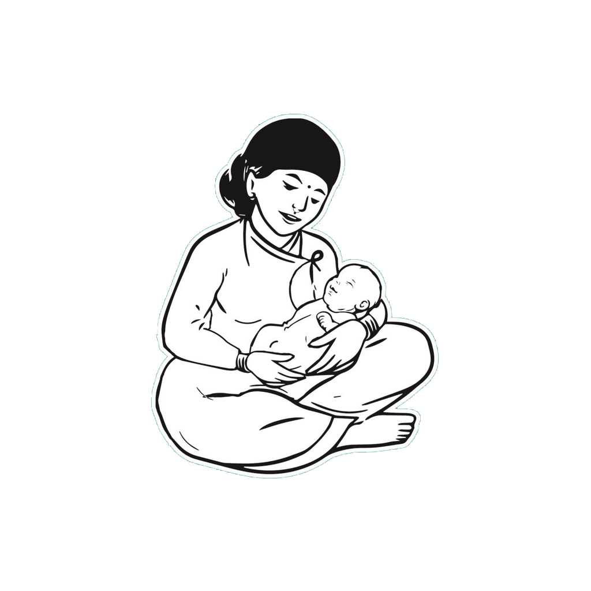
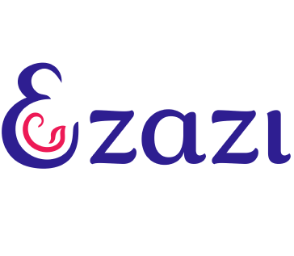
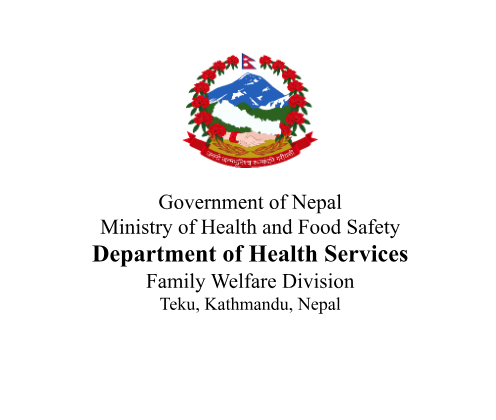
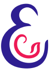
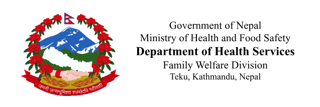
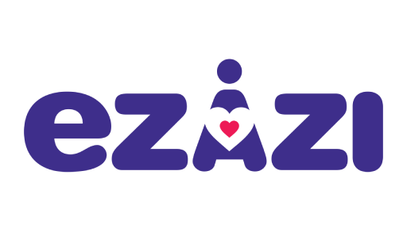
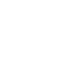

# Brand image assets — what exists, where it appears, what is needed

Current state of every brand-varying image in the app, one section per place it appears, eZazi
then eLCG Nepal. For icon *history* and how the current icons came to be, see
[BRAND-ICON-FORENSICS.md](BRAND-ICON-FORENSICS.md) — this document is only about what to supply.

The app is one codebase shipped as separate products — eZazi (India), eLCG (Nepal), Bangladesh
next. Of 340 image resources, only **8 names** differ per brand. They are all below.

Sizes marked *"drawn at"* are the on-screen size on a tablet, which is what the product is used
on. Required pixel sizes are that figure at the highest screen density we support.

---

## 1 — App icon

| | file | current |
|---|---|---|
| eZazi | `splash_icon_art.png` | 432 × 432 |
| eLCG | `ic_launcher_foreground.png` | 1024 × 1024 |

 

**Needed: 1024 × 1024, square, transparent, artwork inside the central 66%** (about 676 × 676).

The 66% is fixed by Android, not by us — the launcher masks the outer quarter into a circle or
squircle depending on the phone, so anything near the edge is cropped away. eZazi's artwork
currently fills only 29% of its canvas, which is why that icon looks undersized on the home
screen.

---

## 2 — Launch splash

The brief flash while the app starts, before the app's own splash screen.

| | file | current |
|---|---|---|
| eZazi | `splash_icon_art.png` | 432 × 432 — **the same file as the app icon** |
| eLCG | `splash_icon_art.png` | 1024 × 1024, green background baked in |

 

**Needed: 1024 × 1024, square, transparent.** Drawn at 180dp on tablet, 100dp on phone.

---

## 3 — Splash screen

The app's own splash, after launch.

| | file | current |
|---|---|---|
| eZazi | `logo_ezazi.png` | 364 × 317 |
| eLCG | `logo_ezazi.png` | 496 × 420 |

 

**Needed: 1024 × 1024, square, transparent.** Drawn at 280 × 250dp on tablet.

---

## 4 — Login screen

| | file | current |
|---|---|---|
| eZazi | `login_screen_icon.png` | **103 × 144** |
| eLCG | `login_screen_icon.png` | 496 × 420 |

 

**Needed: 1024 × 1024, square, transparent.** Drawn at 280 × 280dp on tablet.

eZazi's 103 × 144 is the lowest-resolution asset in the app — displayed at roughly four times its
own size, so it is visibly soft.

---

## 5 — Home screen header

| | file | current | |
|---|---|---|---|
| eZazi | `home_logo.xml` | vector | **done** |
| eLCG | `home_logo.png` | 637 × 213 | outstanding |

*(eZazi's is an Android vector drawable and will not preview here.)*

**Needed: aspect 3.4 : 1** — 1360 × 400 as a PNG, or any size as a vector. Artwork fills **65% of
the height, centred both ways**. Drawn at 100dp tall.

This is the one slot with a strict shape, and the reason is worth knowing: the app applies **one
height setting to every brand's header logo**. If one file is cropped tight to the artwork and
another carries a margin, the same setting makes one brand look bigger than the other. Measured:
eZazi's artwork is 65% of its canvas height, Nepal's is 100% — cropped hard to the edges — which
is exactly why Nepal's renders noticeably larger. Following the 3.4 : 1 / 65% / centred convention
means one setting works for all brands and a new country needs no development work.

---

## 6 — Status bar notification

| | file | current |
|---|---|---|
| eZazi | `ic_notification.png` | 512 × 288 |
| eLCG | `ic_notification.png` | 96 × 96 |

 

**Needed: 96 × 96, square, transparent, one solid shape — no text, no colour, no fine lines.**

Drawn at 24dp, about the size of a full stop, and **Android discards the colours entirely** and
renders only the silhouette. eZazi's is currently the full wordmark, which is unreadable at that
size; eLCG's line drawing collapses into a blob. **This is the only slot that needs new artwork
rather than a re-export.**

---

## Summary

| # | section | required |
|---|---|---|
| 1 | App icon | 1024 × 1024 square |
| 2 | Launch splash | 1024 × 1024 square |
| 3 | Splash screen | 1024 × 1024 square |
| 4 | Login screen | 1024 × 1024 square |
| 5 | Home header | 3.4 : 1 wide, artwork 65% of height |
| 6 | Status bar | 96 × 96 mono |

**Two sizes cover everything**, plus one small symbol:

- **1024 × 1024 square, transparent** — sections 1 to 4
- **3.4 : 1 wide, transparent** — section 5
- **96 × 96 mono, transparent** — section 6

SVG is welcome instead of PNG for any of them and is better for us — it works at every size and
means we need not ask again.

### How much of the square the artwork should fill

The pixel size above only controls sharpness. What controls how **big** a logo looks on screen is
how much of its canvas the artwork actually fills, because the app gives each logo a fixed-size
box and fits the whole image into it. An image with wide empty margins therefore shows a smaller
logo than a tightly cropped one of the same pixel size.

So, alongside the sizes above:

| Where | How much of the canvas the artwork should fill |
|---|---|
| App icon (1) | Inside the **middle 66%** — the launcher crops the rest |
| Opening, splash, login (2, 3, 4) | **Cropped tight to the artwork**, no margin |
| Home header (5) | **65% of the height, centred** |
| Status bar (6) | **Cropped tight to the artwork**, no margin |

The app icon is the only one that needs breathing room built in. Anywhere else, empty margin is
not neutral — it silently shrinks the logo.

---

## Two open decisions

**Which mark goes in the square slots.** Sections 1 to 4 are all square, so one file per brand
could serve all four — but the two brands currently use *different* marks across them. eZazi shows
its monogram on the icon and login but its wordmark on the splash; eLCG shows the mother-and-baby
on the icon but the government block on the splash and login. Until that is settled it is two
square files per brand, not one.

**Whether the status-bar symbols get designed.** They are the only genuinely new artwork on the
list, and the current ones do not work. Everything else is a re-export of art that already exists.
